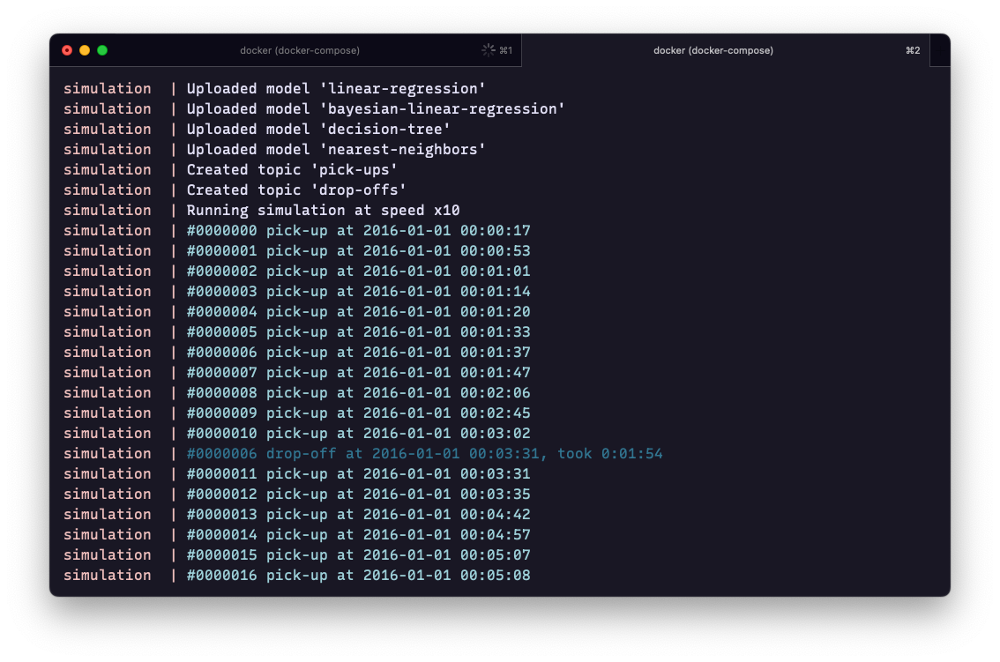
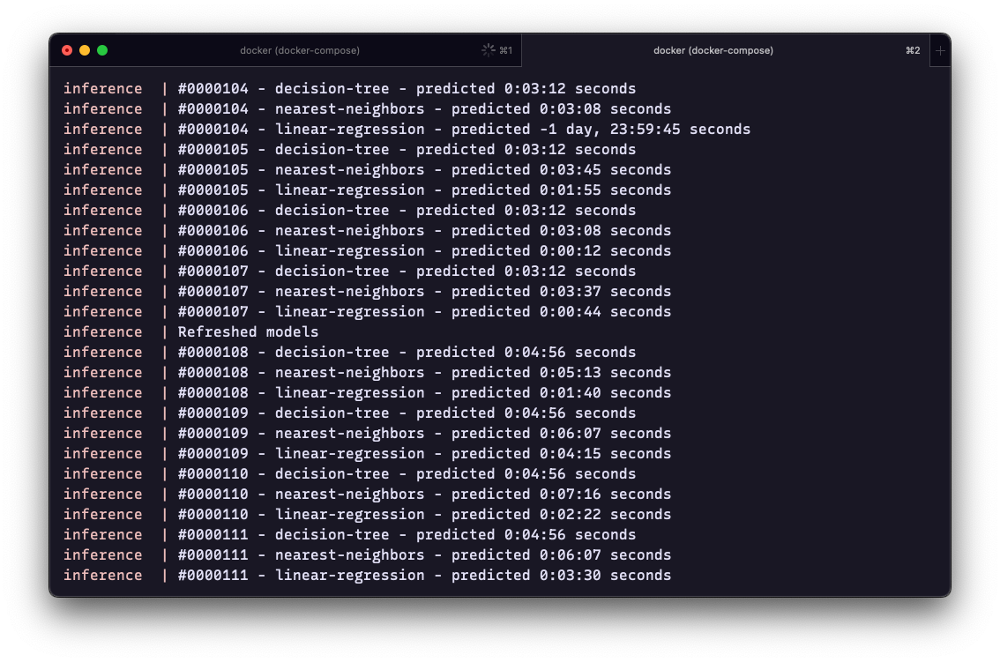
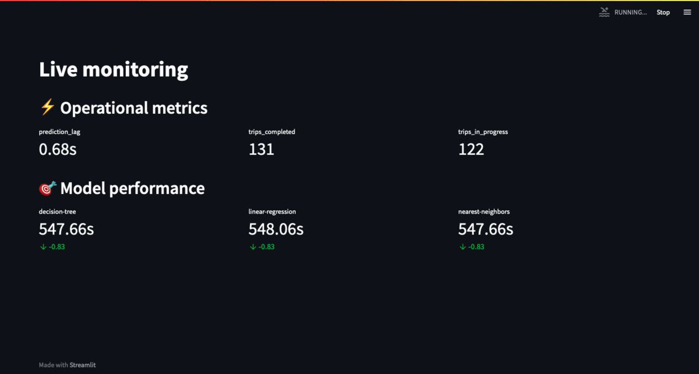
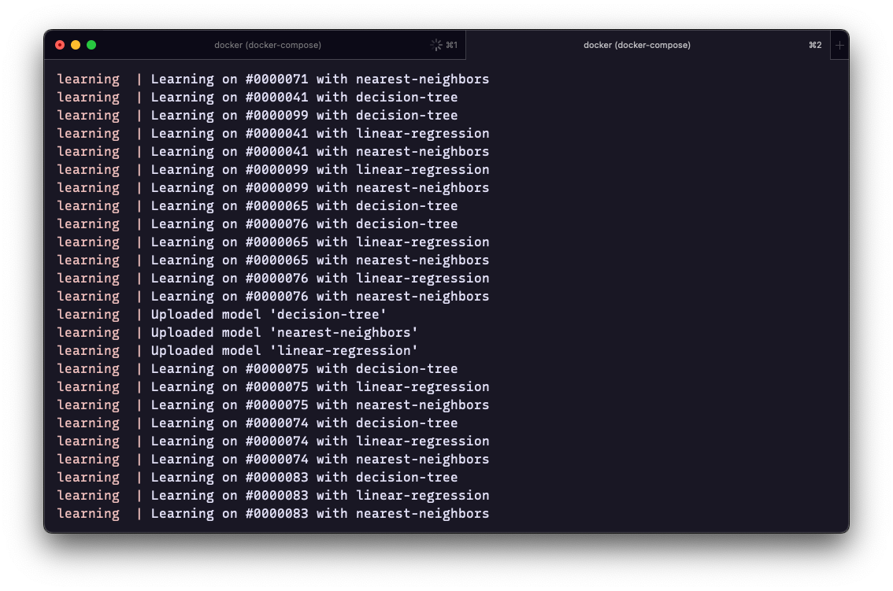

# Predicting (and learning) taxi trip durations in real-time

This is a self-contained demo using [Redpanda](https://redpanda.com/), [Materialize](https://materialize.com/), [River](https://riverml.xyz/), [Redis](https://redis.io/), and [Streamlit](https://streamlit.io/) to predict taxi trip durations 🔮

The purpose of this contrived example is to demonstrate how the streaming analytics ecosystem can work together 🤝

Each technology has been picked for a particular purpose, but each one could be replaced with an alternative. [Kafka](https://kafka.apache.org/) could replace Redpanda. [Flink](https://flink.apache.org/), [Pinot](https://pinot.apache.org/), or [Bytewax](https://www.bytewax.io/) could stand in for Materialize. You may also want to use a feature store such as [Feast](https://www.tecton.ai/feast/) if that floats your boat. Redis could be replaced with any other storage backend, or even a dedicated model store like [MLflow](https://www.mlflow.org/docs/latest/model-registry.html). Any other dashboarding tool other than Streamlit could be used for visual monitoring.

## Architecture

<div align="center">
    
</div>

</br>

🦊 Redpanda acts as a message bus, storing the data produced by the entire system.

🚕 Taxi trips are [simulated](simulation/) with a Python script. An event is sent to Redpanda each time a taxi departs. The duration of the trip is also sent to Redpanda once the taxi arrives at its destination.

🍥 Materialize consumes the pick-up and drop-off topics from Redpanda, and does stream processing on top. It keeps track of the system as a whole, builds aggregate features in real-time, and monitors the model's predictive performance.

🌊 A River model is listening to Materialize for taxi pick-ups. It makes a prediction each time a taxi departs. The prediction is sent to Redpanda, and then gets picked up by Materialize.

🔮 The River model is also listening to Materialize for taxi drop-off. Each time a taxi arrives, Materialize joins the original features with the trip duration. This labelled sample is fed into the River model.

📮 The [inference](inference/) and [learning](learning/) services coordinate with one another by storing the model in a Redis instance. The latter acts as a primitive model store.

💅🏻 Streamlit is used to monitor the overall system in real-time.

🐳 The system is Dockerized, which reduces the burden of connecting the different parts with each other.

✍️ The whole thing is made up of ~220 lines of Python, ~120 lines of SQL, and ~100 lines of YAML/Dockerfile.

## Demo

The first service is in charge of simulating the data stream. For each trip, it first emits an event indicating a taxi has departed. Another event is sent once the taxi arrives. This is all managed by the [`simulation`](simulation) service, which loops over the data at 10 times the actual speed the events occur in the dataset. Before this all happens, the service also uploads some models to Redis, which acts as a model store.

<div align="center">
    
</div>

All events are stored in the Redpanda message queue. These then get enriched by Materialize, which computes real-time features and joins them with each taxi departure. The [`inference`](inference) service listens to Materialize with a [`TAIL` query](https://materialize.com/docs/sql/tail/). For every sample, the service loops through each model, generates a prediction, and sends the `(trip_id, model, features, prediction)` information to RedPanda.

<div align="center">
    
</div>

At this point, there are three topics in RedPanda: `drop_offs`, `pick_ups`, and `predictions`. The [`monitoring`](monitoring) service leverages Materialize to join m all on the `trip_id` key they share. This allows measuring the actual trip duration, which can then be compared to each prediction, thereby allowing to monitor the live performance of each model. It's also possible to measure the prediction lag: the elapsed time between when a pick-up event was emitted, and when a prediction was made. This all gets displayed in auto-refreshing Streamlit app.

</br>
<div align="center">
    
</div>
</br>

The `predictions` topic, which holds the `features` were used, is joined with the other topics to generate labelled data. This is listened to by the [`learning`](learning) service. The latter updates each model every time a trip ends. The models are sent back to Redis every 30 seconds. The `inference` service also refreshes its models every 30 seconds. Redis thus acts as a dead drop for the `inference` and `learning` services to coordinate with another.

<div align="center">
    
</div>

## Running it yourself

Grab the code and run it with [Docker Compose](https://docs.docker.com/compose/):

```sh
# Clone it
git clone https://github.com/MaxHalford/taxi-demo-rp-mz-rv-rd-mb
cd taxi-demo-rp-mz-rv-rd-mb

# Run it
docker-compose up -d
```

Then go to [localhost:8501](http://localhost:8501/) to access the live dashboard.

Here are some useful commands you may use additionally:

```sh
# See what's running
docker stats

# Follow the logs for a particular service
docker compose logs simulation -f
docker compose logs inference -f
docker compose logs learning -f

# See the predictions flowing in
docker exec -it redpanda rpk topic consume predictions --brokers=localhost:9092

# Clean slate
docker compose down --rmi all -v --remove-orphans
```

## Going further

This demo is only one way of doing online machine learning. It's also quite narrow, as it's a supervised learning task, which is arguably simpler to reason about than, say, a recommender system. There are a lot of rabbit holes to explore. Here are a bunch of thoughts loosely organised to give some food for thought.

The features `x` used during inference are stored aside -- in the message bus. They are then joined -- thanks to Materialize -- with the label `y` once it arrives. That pair `(x, y)` is fed into the model for learning. This is called the "log and wait" technique. You can read more about it from Fennel AI [here](https://blog.fennel.ai/p/real-world-recommendation-systems), from Tecton [here](https://www.tecton.ai/blog/time-travel-in-ml/), and from Faire [here](https://craft.faire.com/building-faires-new-marketplace-ranking-infrastructure-a53bf938aba0).

Materialize is arguably doing most of the work in this setup. It's quite impressive how much you can do with a database and a query language on top. This is even more so true when the database does stream processing. There's many good reasons to push computation into the database. For instance, doing real-time feature engineering with Materialize is much more efficient than doing it in Python. Likewise, it's very easy to do performance monitoring in SQL once you've logged the predictions and the labels. You can read more about this "bundling into the database" idea from Ethan Rosenthal [here](https://www.ethanrosenthal.com/2022/05/10/database-bundling/).

This system is event-driven. The simulation, which is the client, doesn't ask the system to make a prediction. Instead, it queues a taxi departure event into the system. It could then poll the system until a prediction has been made. An alternative would have been to expose an API with blocking calls. When you design an (online) machine learning system, a major decision has to be made between a reactive system driven by events, and a proactive system driven by API calls.

The inference and learning services are listening to Materialize. The advantage here is that Materialize takes care of enriching the events, for instance with features, and passes them on the services. The services don't have to do this enrichment process themselves. An alternative would have been to listen to events with RedPanda, calculate features in Materialize, and join the events with the features when necessary. The downside is that it would require more networking.

The predictions for every model are being stored in RedPanda. This allows comparing models with each other in real-time. In theory, it is possible to build a model selection mechanism with Materialize. At each timestamp, the best model would be determined with respect to its previous predictions. The best model at a given timestamp would be the one who's predictions should actually be the one that get served.

Of course, there is, a lot more to discuss. I haven't even discussed the user experience of building models, testing them offline, deploying them, comparing them, promoting them, etc. There's a lot of work left to turn this demo into a fully-fledged piece of software that anyone could use to deploy any number of online machine learning models. This is something we're trying to tackle within the [Beaver](https://github.com/online-ml/beaver) project.

## License

This is free and open-source software licensed under the [MIT license](LICENSE).
